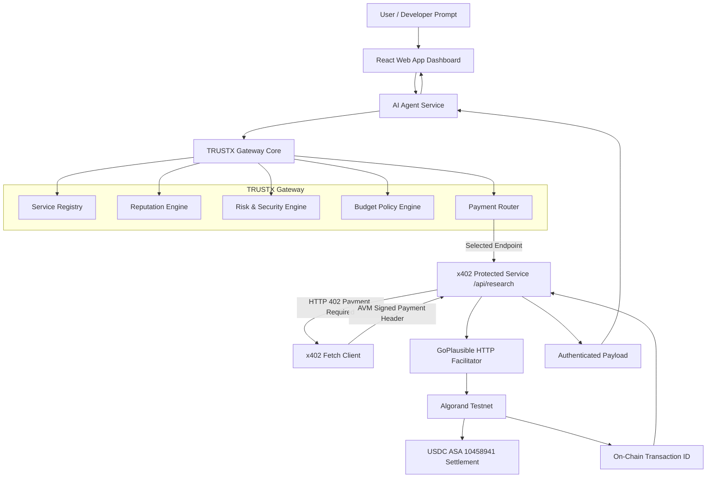

# TRUSTX — Autonomous Agent Trust & Payment Gateway

> **Tagline:** Trust before spend. Optimize before pay.

---

## Overview

TRUSTX is an AI-agent trust, security, budget, and payment-routing gateway for autonomous agents consuming machine-payable web APIs. Before an agent spends money, TRUSTX evaluates the service, checks security risks, enforces financial policies, selects the optimal provider, and executes x402 payment settlement

As AI agents increasingly gain authority to invoke external tools and pay per API call, they should not spend funds blindly. Before executing an on-chain transaction over the **x402 protocol**, TRUSTX evaluates service trust metrics, inspects security risk indicators, enforces agent budget constraints, and dynamically routes payment to the optimal provider.

---

## Why TRUSTX?

1. **Why Trust-Aware Payments for AI Agents?**
   AI agents can execute dozens of API calls autonomously. Without a pre-payment trust layer, agents risk spending funds on malicious, unreliable, or low-quality services. TRUSTX provides a transparent reputation score and multi-attribute decision matrix before any payment signature occurs.

2. **Why x402 Protocol?**
   The x402 payment standard leverages standard HTTP `402 Payment Required` status codes to allow instant, internet-native micropayments without mandatory user account creation, API key management, or subscription lock-in.

3. **Why Algorand & USDC ASA?**
   Algorand offers sub-second finality, micro-penny transaction fees, high throughput, and environmental efficiency. USDC ASA (`10458941` on Testnet) provides a stable, low-friction settlement asset for machine-to-machine micro-transactions.

---

## System Architecture



---

Technology Stack

Frontend
React 18 & Vite: Developer dashboard with live execution timelines, security controls, budget controls, and transaction history.
Tailwind CSS & Lucide Icons: Enterprise-grade responsive UI.
TypeScript: Shared type definitions across client and server.

Backend
Node.js & Express.js: REST API server hosting @x402/express middleware and TRUSTX engine modules.
MongoDB / Mongoose: Stores service catalog metadata, agent run timelines, security events, and settlement transactions.
In-memory fallback: Allows local development when MongoDB is unavailable.

AI / Agent Layer
AI Agent Workflow: Orchestrates the complete autonomous execution process from user request understanding to service selection, security evaluation, budget validation, payment, and result synthesis.
LLM Integration: AI model integration can be configured through AI_API_KEY for intelligent request processing and agent capabilities.
AIAgentService: Backend service responsible for orchestrating the agent workflow.

Trust & Governance
Reputation Engine: Generates transparent 0–100 TRUSTX service trust scores.
Risk Engine: Detects security and trust risks before payment.
Budget Policy Engine: Enforces spending limits and financial policies.
Payment Router: Selects the optimal service using trust, price, latency, and reliability.

Payments & Blockchain
x402 Protocol: HTTP-native payment protocol using HTTP 402 Payment Required.
Algorand Testnet: Blockchain settlement network.
USDC ASA 10458941: Stable payment asset.
@x402/avm & algosdk: Algorand x402 payment signing and blockchain integration.
GoPlausible Facilitator: Verifies and settles x402 payments.

Deployment
Vercel: Frontend deployment.
Environment Variables: Secure configuration of backend credentials and payment parameters.

## Core Engine Modules

### 1. Reputation Engine

Calculates a transparent TRUSTX-generated service trust score from 0–100 using:

Trust Score =
(0.30 × Success Rate)
+ (0.25 × Transaction History)
+ (0.20 × Availability)
+ (0.15 × Latency Performance)
+ (0.10 × User Feedback)

The dashboard exposes the individual components so the score is explainable rather than a black-box rating.
*Clearly labeled as "TRUSTX-generated reputation score".*

### 2. Risk Engine
Explainable security rule engine checking for:
- Prompt injection / malicious instruction patterns
- Low trust scores (<50)
- Price anomalies (micropayments > $0.50)
- Unregistered service destinations

### 3. Budget Policy Engine
Enforces financial guardrails:
- `dailyBudget`: Total USDC cap per day (e.g. $1.00)
- `maxPerTransaction`: Maximum single request cost (e.g. $0.10)
- `minimumTrustScore`: Minimum trust threshold (e.g. 50)
- `allowedCategories`: Category whitelist (`['research', 'data', 'compute', 'ai']`)

### 4. Payment Router
Dynamic multi-attribute decision matrix:
$$\text{Composite Score} = (0.35 \times \text{Trust}) + (0.25 \times \text{PriceScore}) + (0.20 \times \text{LatencyScore}) + (0.20 \times \text{Reliability})$$

---
## AI Agent Workflow

TRUSTX includes an autonomous agent workflow that coordinates the
different TRUSTX engines before executing a paid API request.

Workflow:

User Request
    ↓
Request Understanding
    ↓
Service Discovery
    ↓
Reputation Evaluation
    ↓
Optimal Service Selection
    ↓
Security & Risk Evaluation
    ↓
Budget Policy Evaluation
    ↓
x402 Payment Request
    ↓
Payment Signing
    ↓
Facilitator Verification & Settlement
    ↓
Research Result Synthesis

The agent workflow is implemented in AIAgentService and coordinates
the Reputation Engine, Risk Engine, Budget Engine, Payment Router,
and x402 payment client.

## Quick Start & Local Setup

### 1. Installation
```bash
git clone https://github.com/your-username/TrustX402.git
cd TrustX402
npm install
```

### 2. Configure Environment Variables
Copy `.env.example` to `.env`:
```bash
cp .env.example .env
```

Parameters in `.env`:
```env
NODE_ENV=development
PORT=5000
MONGODB_URI=
FACILITATOR_URL=https://facilitator.goplausible.xyz
X402_NETWORK=algorand:SGO1GKSzyE7IEPItTxCByw9x8FmnrCDexi9/cOUJOiI=
USDC_ASSET_ID=10458941
PAYMENT_RECEIVER_ADDRESS=
AVM_MNEMONIC=
```

### 3. Running the Project
Build shared types and start backend + frontend concurrently:
```bash
npm run dev
```

- **Frontend Dashboard:** `http://localhost:3000`
- **Backend API:** `http://localhost:5000`

---

## Testing & Verification

### Run Unit Tests

npm test

Runs unit tests for the Reputation Engine, Risk Engine,
Budget Policy Engine, and Payment Router.

### Run x402 End-to-End Verification

npm run verify-x402 --workspace=server

Executes the complete Algorand x402 verification flow:

HTTP 402 Payment Required
→ Payment Challenge Decoding
→ AVM Payment Signing
→ GoPlausible Verification
→ GoPlausible Settlement
→ Real Algorand Testnet Transaction ID
→ Explorer Verification

### Run End-to-End Test Suite
```bash
npm run test:e2e --workspace=server
```
Executes complete safe demo workflow (HTTP 402 -> AVM Sign -> Facilitator Settle -> Transaction ID) and unsafe demo workflow (Risk & Budget Block).

---

## API Endpoints

- `GET /api/health`: Health status & network parameters.
- `GET /api/services`: List discovered registry services.
- `GET /api/services/:id/reputation`: Get transparent trust score breakdown.
- `POST /api/security/check`: Evaluate prompt injection & risk rules.
- `POST /api/policy/check`: Evaluate budget limits.
- `POST /api/router/select`: Perform weighted service selection.
- `POST /api/agent/run`: Run autonomous agent workflow.
- `POST /api/research`: **x402-Protected Endpoint** ($0.03 USDC on Algorand Testnet).
- `GET /api/transactions`: List verified on-chain settlements.

---


